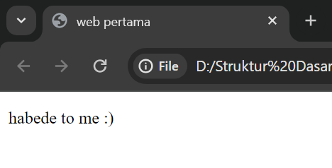
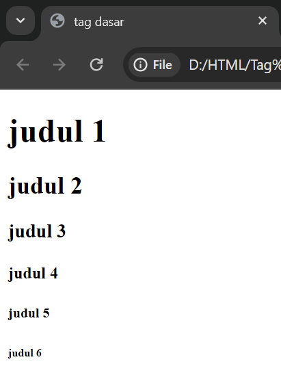
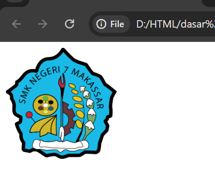
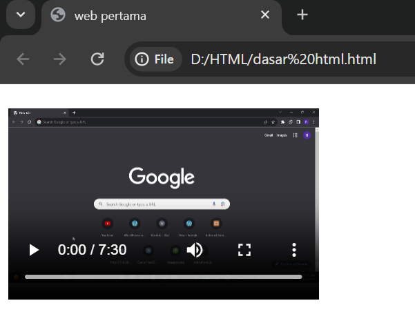
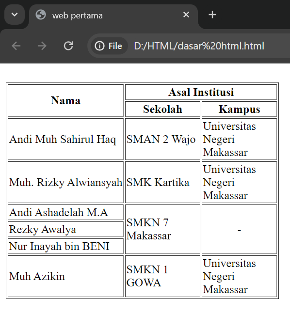
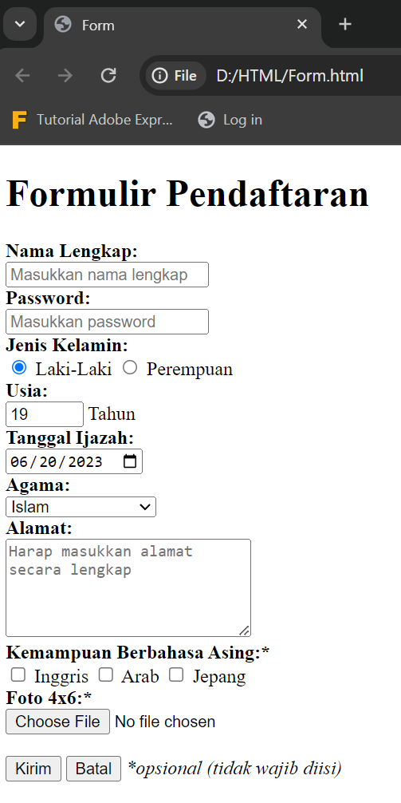
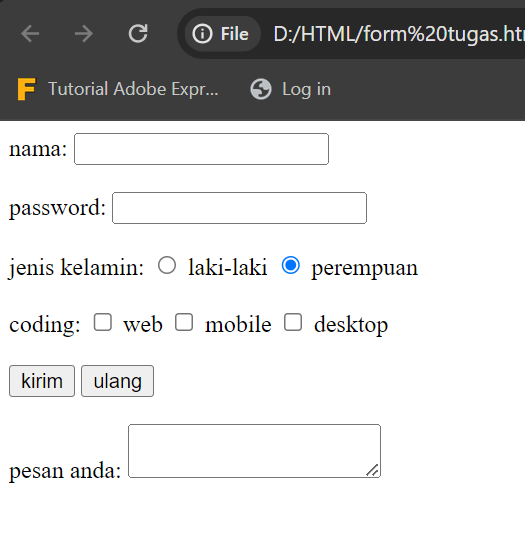
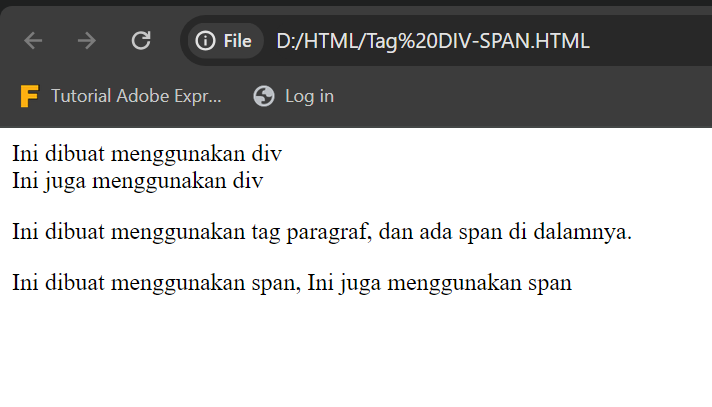

# Struktur HTML

```html
<!DOCTYPE html>
<html>
    <head>
        <title>web pertama</title>
    </head>
    <body>
        <p>habede to me :)</p>
    </body>
</html>
```

- Tag ``<!DOCTYPE html>`` memberitahukan web browser bahwa dokumen HTML adalah versi 5.
- Tag pembuka ``<html>`` menandai awal sebuah dokumen HTML sampai dengan tag penutup ``</html>``
- Tag pembuka ``<head>`` berisi informasi tentang halaman HTML sampai dengan tag penutup ``</head>`` , biasanya dalam tag ``<title>`` untuk memberikan informasi judul halaman HTML.
- Apapun tag yang berada di antara tag pembuka ``<body>`` sampai dengan tag penutup ``</body>`` akan tampil di web browser.



# Anatomi Elemen HTML

```HTML
<a href="https://www.google.com">Klik Google !</a>
```

- Tag pembuka ``<a>`` menandai awal sebuah link sampai dengan tag penutup ``</a>`` . Tag ``<a>`` digunakan untuk membuat link (tautan).
- `href` adalah nama atribut yang berfungsi untuk menambahkan link.
- https://www.google.com adalah nilai atribut atau sebuah link yang akan dimasukkan.
- `Klik Google !` adalah konten atau isi tag yang akan di tampilkan pada web.


# Tag Dasar
## Heading 
- Heading adalah Tag HTML yang digunakan untuk menunjukkan bagian penting atau judul pada halaman website dan memiliki enam tingkatan yang berurutan yaitu `H1` hingga `H2`.

```HTML
<!DOCTYPE html>
<html>
    <head>
        <title>tag dasar</title>
    </head>
    <body>
        <h1>judul 1</h1>
        <h2>judul 2</h2>
        <h3>judul 3</h3>
        <h4>judul 4</h4>
        <h5>judul 5</h5>
        <h6>judul 6</h6>
    </body>
</html>
```




## Paragraf
### Tag ``<p>``
Tag Paragraf biasanya digunakan untuk paragraf teks atau artikel. Paragraf pada HTML dibuat dengan tag ``<p>``.
### Tag ``<b>``
Teks tebal biasanya digunakan untuk memberikan penegasan pada teks tertentu, misalnya seperti judul, subjudul, huruf penting, dll. Tag yang digunakan untuk membuat teks tebal di HTML adalah tag ``<b>`` (bold).
### Tag ``<u>``
Tag ``<u>`` berarti menggarisbawahi teks (underline) di HTML yang berfungsi menambahkan penekanan pada bagian tertentu dari konten web, seperti tautan penting atau detail yang ingin kamu soroti.
### Tag ``<i>``
Tag ``<i>``  adalah sebuah atribut yang berfungsi untuk memiringkan teks.
### Tag `<br>`
adalah sebuah tag yang berguna untuk membuat baris baru.
### Tag ``<hr>``
adalah sebuah tag yang berfungsi untuk menambahkan garis horizontal.

### Contoh
```html
<!DOCTYPE html>
<html>
    <head>
        <title>PARAGRAF</title>
    </head>
    <body>
        <p>Tag p merupakan tag yang menandakan bahwa teks ini sebuah paragraf</p>
        <b>Tag b berfungsi untuk menebalkan sebuah teks/elemen</b><br>
        <u>Tag u berfungsi untuk memberikan garis bawah pada sebuah teks</u><br>
        <i>Tag i berfungsi untuk memiringkan sebuah teks</i>
        <br>Tag br berfungsi untuk membuat baris baru <br>
        Tag hr berfungsi untuk membuat garis horizontal<hr>
    </body>
</html>
```
### Hasil


### Align
`Align` merupakan atribut yang digunakan untuk perataan teks pada paragraf.

```html
<!DOCTYPE html>
<html>
    <head>
        <title>web pertama</title>
    </head>
    <body>
        <h3>Belajar Menggunakan Elemen Tag HTML P</h3>
        <p align="left">
            Lorem Ipsum adalah contoh teks atau dummy dalam industri percetakan dan penataan huruf atau typesetting. Lorem Ipsum telah menjadi standar contoh teks sejak tahun 1500an, saat seorang tukang cetak yang tidak dikenal mengambil sebuah kumpulan teks dan mengacaknya untuk menjadi sebuah buku contoh huruf. Ia tidak hanya bertahan selama 5 abad, tapi juga telah beralih ke penataan huruf elektronik, tanpa ada perubahan apapun. Ia mulai dipopulerkan pada tahun 1960 dengan diluncurkannya lembaran-lembaran Letraset yang menggunakan kalimat-kalimat dari Lorem Ipsum, dan seiring munculnya perangkat lunak Desktop Publishing seperti Aldus PageMaker juga memiliki versi Lorem Ipsum.
        </p>
        <p align="right">
            Lorem Ipsum adalah contoh teks atau dummy dalam industri percetakan dan penataan huruf atau typesetting. Lorem Ipsum telah menjadi standar contoh teks sejak tahun 1500an, saat seorang tukang cetak yang tidak dikenal mengambil sebuah kumpulan teks dan mengacaknya untuk menjadi sebuah buku contoh huruf. Ia tidak hanya bertahan selama 5 abad, tapi juga telah beralih ke penataan huruf elektronik, tanpa ada perubahan apapun. Ia mulai dipopulerkan pada tahun 1960 dengan diluncurkannya lembaran-lembaran Letraset yang menggunakan kalimat-kalimat dari Lorem Ipsum, dan seiring munculnya perangkat lunak Desktop Publishing seperti Aldus PageMaker juga memiliki versi Lorem Ipsum.
        </p>
        <p align="center">
            Lorem Ipsum adalah contoh teks atau dummy dalam industri percetakan dan penataan huruf atau typesetting. Lorem Ipsum telah menjadi standar contoh teks sejak tahun 1500an, saat seorang tukang cetak yang tidak dikenal mengambil sebuah kumpulan teks dan mengacaknya untuk menjadi sebuah buku contoh huruf. Ia tidak hanya bertahan selama 5 abad, tapi juga telah beralih ke penataan huruf elektronik, tanpa ada perubahan apapun. Ia mulai dipopulerkan pada tahun 1960 dengan diluncurkannya lembaran-lembaran Letraset yang menggunakan kalimat-kalimat dari Lorem Ipsum, dan seiring munculnya perangkat lunak Desktop Publishing seperti Aldus PageMaker juga memiliki versi Lorem Ipsum.
        </p>
        <p align="justify">
            Lorem Ipsum adalah contoh teks atau dummy dalam industri percetakan dan penataan huruf atau typesetting. Lorem Ipsum telah menjadi standar contoh teks sejak tahun 1500an, saat seorang tukang cetak yang tidak dikenal mengambil sebuah kumpulan teks dan mengacaknya untuk menjadi sebuah buku contoh huruf. Ia tidak hanya bertahan selama 5 abad, tapi juga telah beralih ke penataan huruf elektronik, tanpa ada perubahan apapun. Ia mulai dipopulerkan pada tahun 1960 dengan diluncurkannya lembaran-lembaran Letraset yang menggunakan kalimat-kalimat dari Lorem Ipsum, dan seiring munculnya perangkat lunak Desktop Publishing seperti Aldus PageMaker juga memiliki versi Lorem Ipsum.
        </p>
    </body>
</html>
```


#### Align left
Fungsi `align left` untuk merapikan teks atau kalimat yang sudah diketik agar diatur ke sebelah kiri.
#### Align Right
Fungsi` align left` untuk merapikan kata atau kalimat yang sudah diketik agar diatur ke sebelah kanan.
#### Align Center
Fungsi `align left` untuk merapikan kata atau kalimat yang sudah diketik agar diatur ke tengah.
#### Align Justify
Fungsi `align justify` untuk merapikan kata atau kalimat yang sudah diketik agar teratur rata kanan kiri.
## Komentar
`Komentar` tidak akan ditampilkan pada halaman website namun programmer biasanya menggunakan `komentar` untuk memperjelas kode program.

contoh:
```html
<!-- Ini komentar, tidak akan tampil di browser-->
        <p>Ini bukan komentar, dan akan tampil di browser</p>
```

hasil:


## List
`List` adalah fungsi dalam HTML yang digunakan untuk menampilkan daftar dari sesuatu. Dalam HTML, tag list dari 2 jenis, ``<ol>`` ordered list (berurutan) dan ``<ul>`` unordered list (tidak berurutan). Ordered list akan ditampilkan dengan angka tau huruf, sedangkan unordered list adalah bulatan atau kotak ataupun simbol lainnya.

Untuk menampilkan list dalam HTML dapat menggunakan tag ``<li>`` ... ``</li>`` namun perlu dengan menyisipkan elemen ``<ol>``...``</ol>`` atau ``<ul>``...``</ul>`` ke dalam elemen ``<li>`` tersebut untuk membuat daftar list.

Contoh:
```HTML
<!DOCTYPE html>
<html>
    <head>
        <title>web pertama</title>
    </head>
    <body>
       <h1>Peralatan XI RPL 1</h1>
       <P>Alat-alat</P>
       <ul>
        <li>sapu</li>
        <li>pel</li>
        <li>meja</li>
        <li>meja</li>
       </ul>
       <h1>Nama-Nama</h1>
       <p>Nama-nama</p>
       <ol>
        <li>Alya</li>
        <li>Adel</li>
        <li>Nayah</li>
       </ol>
    </body>
</html>
```

 Hasil:
 
 
 
## Link
`Link` dapat ditemukan di hampir semua halaman web. Link/tautan memungkinkan sebuah teks yang ketika di klik pindah ke halaman lainnya. HTML menggunakan tag ``<a>`` untuk keperluan ini. Link ditulis dengan ``<a>`` yang merupakan singkatan cari `anchor (jangkar)`.

>[! faq]- href
> Setiap tag `<a>` setidaknya memiliki sebuah atribut `href`.  Dimana `href` berisi alamat yang dituju. `href` adalah singkatan dari hypertext reference.

Atribut penting lainnya dari tag ``<a>`` adalah ``target``. Atribut target menentukan tempat untuk membuka dokumen yang ditautkan. Atribut ``target`` memiliki beberapa nilai salah satunya ``_blank`` yang berfungsi untuk membuka tautan di tab baru.

Contoh: 
```html
<!DOCTYPE html>
<html
    <head>
        <title>web pertama</title>
    </head>
    <body>
       <h3>Menggunakan Tag Anchor</h3>
       <a href="https://www.google.com" target="_blank">Klik disini untuk ke google</a><br>
       <a href="file:///D:/HTML/dasar%20html.html">Klik disini untuk ke halaman lain yang saya buat</a>
    </body>
</html>
```

Hasil:


## Multimedia
### Gambar
Dalam HTML, gambar didefinisikan dengan tag ```` . Tag ```` adalah tag kosong, hanya berisi atribut saja, dan tidak memiliki tag penutup.

>[!faq]- src
> Atribut `<src>` setidaknya mesti ada dalam tag ini untuk menentukan URL (alamat web) dari gambar yang ingin ditampilkan.

Atribut ``alt`` menyediakan teks alternatif untuk gambar, jika pengguna karena beberapa alasan tidak dapat melihatnya (karena koneksi lambat, kesalahan pada atribut ``src``, jika web browser telah disetting untuk tidak menampilkan gambar). Jika browser tidak dapat menemukan gambar, maka akan muncul nilai pada atribut ``alt``. 

Dalam tag ```` terdapat juga atribut ``width`` dan ``height`` untuk mengatur ukuran gambar, pada versi HTML5 standar satuan ukuran gambar adalah pixel.
- Misalnya dalam folder root terdapat file gambar bernama logo.png. Untuk menampilkan gambar tersebut kita hanya perlu mengisi nama gambar beserta jenis ekstensi file gambar ke dalam atribut ``src`` , contohnya ``src = "logo.png"
- Untuk menampilkan gambar dari internet carilah link gambar yang akan ditampilkan lalu  masukkan dalam nilai atribut ``src`` , contohnya https://namasitus.com/gambar.png.

Contoh: 
```html
<!DOCTYPE html>
<html>
    <head>
        <title>web pertama</title>
    </head>
    <body>
       
     </body>
</html>
```

Hasil:



Berikut letak gambar yang dimuat pada website di atas:


### Video
Penjelasan:
Fitur HTML5 mencakup dukungan ``<audio>`` dan ``<video>`` asli tanpa memerlukan flash. Tag ``<audio>`` dan ``<video>`` pada HTML5 mempermudah penambahan media ke dalam halaman web. Yang penting untuk diatur pada tag ini adalah atribut src yang berfungsi untuk mengidentifikasi sumber media. Selain itu, terdapat pula atribut `controls` agar pengguna dapat memutar dan menjeda media.

Contoh:
```HTML
<!DOCTYPE html>
<html>
    <head>
        <title>web pertama</title>
    </head>
    <body>
        <video src="./VIDEO/tutorwp.mp4" width="300" height="200" controls>  
        </video>
</html>
```

Hasil:


### Audio
Penjelasan:
Seperti yang telah dibahas sebelumnya bahwasanya tag ``<audio>`` merupakan bagian fitur HTML5 untuk menampilkan audio asli di halaman web tanpa memerlukan flash sebagaimana pada HTML versi 4. Yang penting untuk diatur pada tag ini adalah atribut src yang berfungsi untuk mengidentifikasi sumber media. Selain itu, terdapat pula atribut controls agar pengguna dapat memutar dan menjeda media.

Contoh:
```HTML
<!DOCTYPE html>
<html>
    <head>
        <title>web pertama</title>
    </head>
    <body>
        <audio src="./VIDEO/tutorwp.mp4" controls >  
        </audio>
</html>
```

Hasil:


### iframe
Penjelasan:
Elemen ``<iframe>`` dapat digunakan untuk menampilkan halaman website lain dalam suatu website. atau menampilkan dokumen HTML lain dalam sebuah website. Mudahnya, bisa dibilang website dalam website.
Dalam tag iframe ada beberapa atribut yang penting seperti :
- `src`, untuk mencari sumber halaman HTML atau web yang akan  ditampilkan di dalam frame.
- `width` dan `height`, untuk mengatur ukuran lebar dan panjang dari frame.

Contoh:
```html
<!DOCTYPE html>
<html>
    <head>
        <title>web pertama</title>
    </head>
    <body>
        <iframe src="http://smkn7makassar.sch.id/" width="1250" height="550"></iframe>
</html>
```

Hasil:


## Tabel
### Tabel 1
Penjelasan:
Tabel dalam HTML didefinisikan dengan tag ``<table>``.
- Setiap baris tabel  didefinisikan dengan tag ``<tr>``.
- Header (judul) tabel didefinisikan dengan tag ``<th>``. Secara default, header tabel memiliki teks tebal dan berada di tengah.
- Data tabel/sel didefinisikan dengan tag ``<td>``. Karena sel merupakan bagian terkecil dari tabel maka dari itu tag ini selalu berada di dalam tag ``<tr>``.
Contoh:
```html
<!DOCTYPE html>
<html>
    <head>
        <title>web pertama</title>
    </head>
    <body>
        <table border="1">
            <tr>
                <th>Nama</th>
                <th>Asal Institusi</th>
            </tr>
            <tr>
                <td>Muh.Azikin</td>
                <td>Universitas Negeri Makassar</td>
            </tr>
            <tr>
                <td>Rezky Awalya</td>
                <td>SMKN 7 Makassar</td>
            </tr>
            </table>
        </body>
</html>
```

Hasil:


### Tabel 2
Penjelasan:
Perhatikan bahwa pada tag ``<table>`` terdapat sebuah atribut border. Atribut border digunakan untuk memberikan nilai garis tepi dari tabel. Nilai ini dalam ukuran pixel. `border="1"`, berarti kita menginstruksikan kepada web browser bahwa tabel tersebut akan memiliki garis tepi sebesar 1 pixel. Jika tidak ditambahkan, secara default tabel tidak memiliki garis tepi.

Contoh:
```html
<!DOCTYPE html>
<html>
    <head>
        <title>web pertama</title>
    </head>
     <body>
            <table border="1">
                <tr>
                     <th rowspan="2">Nama</th>
                   <th colspan="2">Asal Institusi</th>
                </tr>
                <tr>
                   <th width="100">Sekolah</th>
                   <th width="100">Kampus</th>
                </tr>
                <tr>
                   <td>Andi Aril</td>
                   <td>SMAN 2 Wajo</td>
                   <td>Universitas Negeri Makassar</td>
                </tr>
                <tr>
                    <td>Muh. Alwi</td>
                   <td>SMK Kartika</td>
                   <td>Universitas Negeri Makassar</td>
                </tr>
                <tr>
                    <td>Andi Ashadelah M.A</td>
                    <td rowspan="3">SMKN 7 Makassar</td>
                    <td align="center" rowspan="3">-</td>
                </tr>
                <tr>
                     <td>Rezky Awalya</td>
                </tr>
                <tr>
                    <td>Nur Inayah bin BENI</td>
                </tr>
                <tr>
                     <td>Muh Azikin</td>
                     <td>SMKN 1 GOWA</td>
                     <td>Universitas Negeri Makassar</td>
                </tr>
            </table>
        </body>
</html>
```

Hasil:


### Tabel Tugas
Penjelasan:
- `border` yaitu sebuah atribut yang mengatur ketebalan garis pinggir dari tabel.
- `rowspan` adalah sebuah atribut html yang menyatukan 2 kolom tabel/lebih menjadi 1 kolom.
- `colspan` adalah sebuah atribut html yang menyatukan 2 baris tabel/lebih menjadi 1 baris.
- `width` adalah sebuah atribut html yang mengatur lebar dari sebuah elemen.
- `height` adalah sebuah atribut html yang mengatur tinggi dari sebuah elemen.
- `align` adalah sebuah atribut html yang berguna untuk mengatur posisi teks pada web
Contoh:
```html
<!DOCTYPE html>
<html>
    <head>
        <title>table</title>
    </head>
    <body>
<table border="1">
            <tr bgcolor="green">
                <th colspan="2" width="100">Nama Hari</th>
                <th colspan="2" width="100">Nama Bulan</th>
            </tr>
            <tr height="30">
                <td>Senin</td>
                <td>Selasa</td>
                <td>April</td>
                <td rowspan="2" align="center">Juni</td>
            </tr>
            <tr height="30">
                <td>Rabu</td>
                <td>Kamis</td>
                <td>Mei</td>
            </tr>
        </table>
    </body>
</html>
```
Hasil:


Analisis:
Untuk tabel "Nama Hari" & "Nama Bulan" merupakan 2 kolom tetapi di tambahkan atribut `colspan` yang membuat 2 kolom menjadi 1.
Begitupun dengan kolom "Juni" yang harusnya terdapat 2 baris tetapi di tambahkan atribut rowspan yang membuat 2 baris menjadi 1.
## Form
Elemen `<form>` HTML digunakan untuk mendefinisikan _form_ yang digunakan untuk mengumpulkan inputan dari pengguna _website_. Tag ini digunakan untuk mengkoleksi inputan dari user, konsep ini sama seperti konsep formulir di dunia nyata.

>[!faq]- form
> Dengan kata lain tag `<form>` merepresentasikan sebuah **“formulir”** di mana satu formulir bisa memiliki banyak kolom isian.

Form HTML berisikan elemen-elemen `form` lainnya. Elemen `<form>` digunakan untuk menampung macam-macam elemen yang berkaitan dengan sebuah `form`, seperti  `password`, `checkbox`, `radio button`, tombol `submit`, dan banyak lagi yang dapat diedit kemudian ditulis untuk dikirim pada sebuah _server_ untuk selanjutnya diproses guna mendapatkan informasi tertentu dari atau untuk _user_.

Umumnya, sebuah _website_ selalu memiliki fitur _form_, contoh paling umum yang sering kita temui adalah seperti _form login_, _form sign up_, _form_ komentar di suatu _blog_/media.
### Input 
Elemen `<input>` adalah elemen `form` yang paling penting. Elemen `<input>` dapat ditampilkan dalam beberapa cara, tergantung pada nilai atribut `type` yang digunakan. Berikut adalah beberapa contoh nilai dari atribut `type` :

- `text` digunakan untuk mengambil isian berupa **teks**. Contohnya seperti nama.
- `password` digunakan untuk mengambil isian berupa **kata sandi** atau sesuatu yang bersifat rahasia. Tipe ini akan mengubah semua karakter yang diketikkan ke dalam karakter bulat
- `radio` digunakan sebagai kolom isian bertipe **pilihan** yang menawarkan beberapa opsi kepada _user_ namun **hanya satu opsi saja** yang boleh dipilih. Contohnya seperti jenis kelamin, pembayaran, dan agama.

>[!faq]- radio
> Perlu diperhatikan bahwa untuk penggunaan tipe `radio` yang berkategori set pilihan yang sama mengharuskan nilai `name` -nya juga sama.

Opsi _default_ dapat dilakukan dengan menambahkan atribut `checked` pada elemen opsi yang dijadikan sebagai opsi _default_.
- `checkbox` digunakan untuk memberikan **daftar pilihan dalam satu set opsi**. _User_ dapat memilih satu atau bahkan **lebih dari satu pilihan** pada tipe ini. Hal ini berbeda dengan tipe sebelumnya yaitu `radio` yang hanya memungkinkan _user_ untuk memilih satu pilhan saja. Contoh penggunaan `checkbox` seperti daftar makanan kesukaan, daftar olahraga yang tidak disukai, dan yang semisalnya.
- `submit` ditampilkan dalam bentuk **tombol untuk mengirim data** pada `<form>` yang menjadi pembungkusnya. Atribut `value` digunakan untuk mengisi teks yang ingin ditampilkan pada tombol.
- `reset` berguna untuk **mengembalikan _state_ (keadaan) atau data dari suatu _form_ ke nilai awalnya**. Jika nilai awal sebuah input adalah kosong, maka ketika direset ia akan kembali kosong. Tapi jika nilai awalnya sudah terisi sesuatu, maka ketika direset datanya akan kembali seperti yang sudah diset sebelumnya.
- `button` berguna untuk membuat **inputan berupa sebuah tombol**. Tombol ini nantinya bisa difungsikan sesuai dengan keinginan dari pengembang web.

### Label
Elemen `<label>` memiliki fungsi khusus untuk **melabeli sebuah kolom inputan**. Ketika _screen reader_ membaca konten halaman HTML, lalu menemukan sebuah inputan, ia akan membaca label yang bersangkutan.

Fungsi lain dari tag `<label>` adalah ketika kita mengklik label, maka browser akan meletakkan fokus pada kolom isian yang terhubung dengannya. Syarat yang perlu diperhatikan yaitu dengan menghubungkan sebuah `<label>` dan `<input>` dengan atribut `for` untuk `label`, dan atribut `id` pada `<input>` dengan nilai untuk kedua atribut tersebut mesti sama persis.

### Select
Elemen `<select>` berguna dalam mendefinisikan sebuah tombol _**dropdown**_ yang dimana _user_ dapat memilih salah satu dari banyak pilihan.

>[!faq]- select
> Elemen `<select>` nantinya berperan sebagai pembungkus dari elemen `<option>` yang berperan sebagai daftar pilihan atau opsi.

Elemen `<select>` hampir mirip fungsinya dengan `<input type=”radio">` akan tetapi baiknya elemen `<select>` digunakan untuk memilih lebih dari 1 pilihan yang terdapat banyak opsi di dalamnya, sedangkan `<input type=”radio">`  digunakan jika _user_ diarahkan untuk memilih hanya satu pilihan dari opsi yang telah di sediakan. Contoh penggunaan elemen ini seperti memasukkan pilihan berupa asal daerah atau yang semisalnya.

Penting untuk diketahui bahwasanya opsi yang aktif secara _default_ adalah adalah opsi yang pertama. Akan tetapi, kita bisa mengatur opsi mana yang aktif secara _default_ dengan menambahkan atribut `selected` pada suatu `<option>` yang ingin dijadikan sebagai opsi _default_.

### Text Area
Elemen `<textarea>` berguna untuk mengambil inputan _user_ berupa teks yang dapat memuat **lebih dari satu baris**. Jika dibandingkan dengan elemen `<input>` teks biasa, elemen `<textarea>` memiliki ukuran tinggi yang lebih besar. Element `textarea` bisa diisi lebih dari satu baris dengan menekan enter.

Atribut yang dapat digunakan untuk mengatur kuran dari `textarea` yaitu `rows` untuk jumlah baris, sedangkan atribut `cols` untuk lebarnya.

### Button
Elemen ``<button>`` yang berada di dalam sebuah ``form`` akan otomatis dianggap sama fungsinya seperti ``<input type="submit">``. Jika ingin membuat tombol biasa yang tidak men-submit  ``<form>`` dapat dilakukan dengan menambahkan atribut ``type="button".``

### Contoh
```html
<!DOCTYPE html>
<html>
    <head>
        <title>Form</title>
    </head>
    <body>
        <h1>Formulir Pendaftaran</h1>
<form action="">
    <div>
      <label for="nama-lengkap"><b>Nama Lengkap:</b></label><br>
      <input type="text" id="nama-lengkap" name="nama_lengkap" placeholder="Masukkan nama lengkap" required>
     </div>
     <div>
       <label for="password"><b>Password:</b></label><br>
       <input type="password" id="password" name="password" placeholder="Masukkan password" required>
      </div>
        <div>
        <b>Jenis Kelamin:</b><br>
        <input id="lk" type="radio" name="jenis_kelamin" checked>
        <label for="lk">Laki-Laki</label>
        <input id="pr" type="radio" name="jenis_kelamin">
        <label for="pr">Perempuan</label>
      </div>
      <div>
        <label for="isian-usia"><b>Usia:</b></label><br>
        <input type="number" id="isian-usia" name="usia" min="17" max="25" value="19" required> Tahun
      </div>
      <div>
         <label for="tgl-ijazah"><b>Tanggal Ijazah:</b></label> <br>
         <input type="date" id="tgl-ijazah" name="tgl_ijazah" min="2021-01-01" value="2023-06-20" required>
      </div>
      <div>
         <label for="opsi-agama"><b>Agama:</b></label><br>
         <select id="opsi-agama" name="agama" required>
           <option disabled>---Pilih Agama----</option>
           <option value="islam">Islam</option>
           <option value="kristen">Kristen</option>
           <option value="katolik">Katolik</option>
           <option value="hindu">Hindu</option>
           <option value="buddha">Buddha</option>
           <option value="atheis" disabled>Atheis</option>
          </select>
       </div>
       <div>
          <label for="alamat"><b>Alamat:</b></label> <br>
          <textarea id="alamat" name="alamat" cols="25" rows="5" placeholder="Harap masukkan alamat secara lengkap" required></textarea>
       </div>
       <div>
          <b>Kemampuan Berbahasa Asing:*</b><br>
            <input type="checkbox" id="inggris" name="bahasa_asing">
            <label for="inggris">Inggris</label>
          <input type="checkbox" id="arab" name="bahasa_asing">
          <label for="arab">Arab</label>
          <input type="checkbox" id="jepang" name="bahasa_asing">
          <label for="jepang">Jepang</label>
       </div>
       <div>
          <label for="isian-foto"><b>Foto 4x6:*</b></label><br>
          <input type="file" id="isian-foto" name="foto" accept="image/png,image/jpg,image/jpeg">
       </div>
       <br>
       <input type="submit" value="Kirim">
       <input type="reset" value="Batal">
       <i>*opsional (tidak wajib diisi)</i>
</form>
    </body>
</html>
```

Hasil:


Beberapa atribut yang digunakan pada contoh di atas yang perlu untuk diperjelas yaitu sebagai berikut:
- `name` - digunakan sebagai nama variabel yang akan diproses oleh web server (contoh menggunakawn PHP)
- `required` - digunakan untuk memastikan bahwa pengguna harus memasukkan nilai pada input tersebut sebelum dapat melakukan proses submit formulir
- `placeholder` - menuliskan teks pada elemen input. Placeholder sangat bermanfaat untuk memberikan teks bantuan kepada user untuk inputan form yang kompleks
- `value` - menentukan nilai awal dari sebuah elemen input
- `disabled` - digunakan untuk menonaktifkan inputan pada elemen yang diberi atribut ini.

### Bagaimana Cara Memproses Form?

Ketika sebuah ``<form>`` disubmit, baik menggunakan elemen ``<button>`` mau pun ``<input type="submit">`` , browser akan mengirimkan data tersebut kepada URL yang didefinisikan pada atribut action di dalam tag form.

Ada pun jika atribut action tidak didefinisikan, maka browser akan menggunakan URL sekarang sebagai tujuan pengiriman data.

Contoh:

```html
<form action="/proses-pendaftaran">
  ...
</form>
```

Pada contoh di atas, ketika form di-submit, browser akan mengirimkan data yang ada  menuju URL /proses-pendaftaran.

### **Apa yang terjadi pada URL /proses-pendaftaran?**

Pada URL tersebut terdapat sebuah aplikasi/program yang berjalan di server (bukan di browser). Tugas dari program tersebut adalah mengelola data yang dikirim seperti misalnya menyimpan data tersebut ke dalam sebuah database.

Bahasa yang umum digunakan di dalam server adalah python, nodejs, PHP, dan lain sebagainya.

Untuk mendapatkan gambaran lebih jelas, sebenarnya akan dijelaskan pada modul selanjutnya yang berkaitan dengan materi PHP atau juga bisa dengan membaca tutorial berikut:

### Referensi
[Link GOOGLE](https://jagongoding.com/web/php/web-dinamis/membuat-dan-menangani-form/)

### Form Tugas
Penjelasan:
- `For` untuk mengarahkan teks ke kolom dan harus sama dengan `id`.
- `name` adalah sebuah atribut yang memiliki fungsi agar hanya bisa memilih 1 dan sesama `name` harus sama isinya.
- `value` adalah isi dari sebuah button/tombol yang akan di klik.

Contoh:
```html
<!DOCTYPE html>
<html>
    <head>
        <title>form tgs</title>
    </head>
    <body>
        <!-- for untuk mengarahkan dan harus sama dengan id -->
        <form action="">
            <div>
            <label for="nama">nama: </label>
            <input type="text" id="nama" required=""><br> <br>
            </div>
            <div>
            <label for="password">password: </label>
            <input type="password" id="password" required=""><br> <br>
            </div>
        <!-- name sebuah atribut yang berfungsi untuk bsa memilih 1-->
            <label for="jenis kelamin">jenis kelamin: </label>
            <input type="radio" name="jk" id="jenis kelamin" >
            <label>laki-laki</label>
            <input type="radio" name="jk" id="jenis kelamin" checked>
            <label>perempuan</label><br> <br>
            <label for="coding"> coding: </label>
            <input type="checkbox" name="web" id="coding"> web
            <input type="checkbox" name="mobile" id="coding"> mobile
            <input type="checkbox" name="desktop" id="coding"> desktop
            <br> <br>
            <!--value gunanya untuk tulisan ditombol, -->
            <input type="submit" value="kirim">
            <input type="reset" value="ulang"><br> <br>
            pesan anda:
            <textarea></textarea>
        </form>
    </body>
</html>
```

Hasil:



## DIV & SPAN
### Penjelasan
`Tag DIV` adalah sebuah elemen tag yang berfungsi untuk memblok satu area yang di sertai dengan baris baru setelahnya.
`Tag SPAN` adalah sebuah elemen html yang berbanding terbalik dari `tag div`.
### Program
```html
<!DOCTYPE html>
<html>
<head>
    <title>DIV-SPAN</title>
</head>
<body>
  
    <div>Ini dibuat menggunakan div</div>
    <div>Ini juga menggunakan div</div>

    <p>Ini dibuat menggunakan tag paragraf,
        <span>dan ada span di dalamnya.</span>
    </p>

    <span>Ini dibuat menggunakan span,</span>
    <span>Ini juga menggunakan span</span>
</body>
</html>
```
### Hasil



